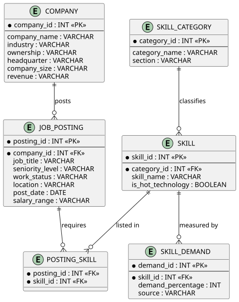

#### Team members:
Joshua Henry, Shawn Ivan Ganz, Zineb Tamnat, Jonnathan Zuna Largo, Izza Khan

## Approach

### Collaboration Tools

Our group will use the following collaboration tools throughout the project:

#### Communication
- Slack direct message group chat

#### Code Sharing
- GitHub repository:  
  [607_project03](https://github.com/Siganz/607_project03)

#### Project Documentation
- Project README:  
  [README.md](https://github.com/Siganz/607_project03/blob/main/README.md)

---

### Data Sources

We identified two primary data sources for this project: **O*NET Online** and **Kaggle**.

#### 1. O*NET Online
O*NET Online provides structured occupational data for the role of Data Scientists, including information on relevant skills and labor demand.

Resources:
- Occupational summary:  
  [O*NET Summary for Data Scientists](https://www.onetonline.org/link/summary/15-2051.00)
- Skills CSV:  
  [onetooonline_datascience_skills.csv](https://raw.githubusercontent.com/Siganz/607_project03/refs/heads/main/data/onetoonline_datascience_skills.csv)
- Demand page:  
  [O*NET Demand for Data Scientists](https://www.onetonline.org/link/demand/15-2051.00)
- Skills demand CSV:  
  [onetooonline_datascience_sklls_demand.csv](https://raw.githubusercontent.com/Siganz/607_project03/refs/heads/main/data/onetoonline_datascience_skills_demand.csv)

#### 2. Kaggle
The Kaggle dataset contains data science job postings and salary-related information for 2025.

Resources:
- Dataset page:  
  [Data Science Careers and Salaries 2025](https://www.kaggle.com/datasets/nalisha/data-science-careers-and-salaries-2025)
- CSV file:  
  [kaggle_data_science_job_posts_2025.csv](https://raw.githubusercontent.com/Siganz/607_project03/refs/heads/main/data/kaggle_data_science_job_posts_2025.csv)

---

### Data Loading

The Kaggle dataset will be downloaded as a CSV file and loaded into R using `read_csv()` from the **tidyverse** package.

The O*NET Online data can be accessed directly from the website and imported from the linked CSV files. Once loaded into R, both datasets will be cleaned and transformed using packages such as **dplyr** and **tidyr**.

Relevant variables such as:
- job title
- employer type
- required skills
- skill rankings

will be extracted to support analysis of the most frequently requested data science skills across job postings.

---

### Logical Model

The logical model integrates job posting data from Kaggle with occupational skill data from O*NET Online.

#### O*NET Entity
- Skills
- Ranking

#### Kaggle Entity
- Job_ID
- Employer_Type
- Job_Title
- Skills

---

### Entity-Relationship (ER) Diagram

The database is designed around a **many-to-many relationship** between jobs and skills.

#### Jobs
- `Job_ID`
- `Employer_Type`
- `Job_Title`

#### Skills
- `Skill_ID`
- `Skill_Name`

#### JobSkills
- `Job_ID`
- `Skill_ID`

The `JobSkills` table acts as a junction table that links jobs and skills. This structure allows:
- one job posting to have many skills
- one skill to appear in many job postings

This normalized design reduces redundancy and supports flexible querying of relationships between jobs and required skills.


## Codebase

### ERD (Entity Relationship Diagram)



### Initializing
We will initialize the project, define the url, read the csv, and glimpse.
```{r}
library(tidyverse)
url_kaggle_data <- "https://raw.githubusercontent.com/Siganz/607_project03/refs/heads/main/data/kaggle_data_science_job_posts_2025.csv"
url_onetonline_skills <- "https://raw.githubusercontent.com/Siganz/607_project03/refs/heads/main/data/onetoonline_datascience_skills.csv"
url_onetonline_demand <- "https://raw.githubusercontent.com/Siganz/607_project03/refs/heads/main/data/onetoonline_datascience_skills_demand.csv"

data_science_posts_df <- read.csv(url_kaggle_data)
data_science_skills_df <- read.csv(url_onetonline_skills)
# Might not need demand?
data_science_demand_df <- read.csv(url_onetonline_demand)

glimpse(data_science_posts_df)
glimpse(data_science_skills_df)
glimpse(data_science_demand_df)
```
### Data Cleaning & DF Creating

We are going to clean and standardize skill names across the job posting, category, and demand datasets, then merge them into one master skill table with unique IDs and category mappings. We are also going to create the related company, job posting, posting-skill, skill category, and skill demand tables so the final dataset follows the project ERD.

```{r}
# Create IDs + clean base
data_science_posts_clean_df <- data_science_posts_df |>
  mutate(
    posting_id = row_number(),
    company_id = as.integer(factor(company))
  ) |>
  relocate(posting_id, company_id)

# Company df creation to match ERD
company_df <- data_science_posts_clean_df |>
  distinct(company_id, .keep_all = TRUE) |>
  select(company_id, industry, ownership, headquarter, company_size, revenue)

# Job Posting df creation to match ERD
job_posting_df <- data_science_posts_clean_df |>
  select(
    posting_id,
    company_id,
    seniority_level,
    work_status = status,
    location,
    post_date,
    salary_range = salary
  )

# Posting Skill df - cleaning skills field to prep for mapping
posting_skill_df <- data_science_posts_clean_df |>
  select(posting_id, skills) |>
  mutate(skills = str_remove_all(skills, "\\[|\\]|'")) |>
  separate_rows(skills, sep = ",") |>
  mutate(
    skills = str_trim(skills),
    skills = str_to_lower(skills)
  ) |>
  rename(skill_name = skills) |>
  mutate(
    skill_name = case_when(
      skill_name %in% c("sklearn", "scikit learn") ~ "scikit-learn",
      skill_name %in% c("amazon", "amazon web services") ~ "aws",
      TRUE ~ skill_name
    ),
    skill_name = str_to_title(skill_name)
  ) |>
  filter(skill_name != "", !is.na(skill_name))

# Posting skill mapping to O*Net skill sources
skill_crosswalk <- tibble::tribble(
  ~skill_id, ~job_skill, ~onet_skill_name,
  1, "Spark", "Apache Spark",
  2, "R", "R",
  3, "Python", "Python",
  4, "Scala", "Scala",
  5, "Machine Learning", NA,
  6, "Tensorflow", "TensorFlow",
  7, "Sql", "Structured query language SQL",
  8, "Aws", "Amazon Web Services AWS software",
  9, "Git", "Git",
  10, "Docker", "Docker",
  11, "Gcp", "Google Cloud software",
  12, "Kubernetes", "Kubernetes",
  13, "Deep Learning", NA,
  14, "Scikit-Learn", "Scikit-learn",
  15, "Pytorch", "PyTorch",
  16, "Keras", NA,
  17, "Java", "Oracle Java",
  18, "Pandas", "pandas",
  19, "Powerbi", "Microsoft Power BI",
  20, "Tableau", "Tableau",
  21, "Hadoop", "Apache Hadoop",
  22, "Azure", "Microsoft Azure software",
  23, "Airflow", "Apache Airflow",
  24, "Linux", "Linux",
  25, "Bash", "Bash",
  26, "Numpy", "NumPy",
  27, "Neural Network", NA,
  28, "Matplotlib", NA,
  29, "Database", NA,
  30, "Scipy", NA,
  31, "Opencv", NA
)

# Posting skills remapping
posting_skill_df <- posting_skill_df |>
  left_join(skill_crosswalk, by = c("skill_name" = "job_skill")) |>
  mutate(skill_name = coalesce(onet_skill_name, skill_name)) |>
  select(posting_id, skill_name)

# Skill Category creation to match ERD
skill_category_df <- data_science_skills_df |>
  rename(section = Section, category_name = Category, skill_name = Example) |>
  distinct(section, category_name, skill_name) |>
  arrange(section, category_name, skill_name) |>
  mutate(category_id = row_number()) |>
  relocate(category_id)

# Prepping skill for eventual mapping
skill <- data_science_demand_df |>
  rename(skill_name = Technology.Skill,
         is_hot_technology = Hot.Technology,
         demand_percentage = Percentage
         )

# Building master skill table from all unique skill names from all 3 sources
all_skills_df <- bind_rows(
  skill_category_df |> select(skill_name),
  skill   |> select(skill_name),
  posting_skill_df  |> select(skill_name)
) |>
  distinct(skill_name) |>
  arrange(skill_name)

# Using skill_demand_df as the base for demand fields
skill <- all_skills_df |>
  left_join(
    skill |>
      select(skill_name, demand_percentage, is_hot_technology),
    by = "skill_name"
  ) |>
  mutate(is_hot_technology = if_else(is.na(is_hot_technology) | is_hot_technology == "", "No",is_hot_technology)) |>
  arrange(skill_name) |>
  mutate(skill_id = row_number()) |>
  select(skill_id, skill_name, demand_percentage, is_hot_technology)

# Skill df Category join
skill <- skill |>
  left_join(
    skill_category_df |>
      select(skill_name, category_id),
    by = "skill_name"
  ) |>
  relocate(skill_id, category_id)

# Skill category clean
skill_category_df <- skill_category_df |>
  select(category_id, section, category_name) |>
  distinct()

# Posting skill_id join and clean
posting_skill_df <- posting_skill_df |>
  left_join(
    skill |> select(skill_id, skill_name),
    by = "skill_name"
  ) |>
  select(posting_id, skill_id, skill_name)

# Skill demand creation 
skill_demand_df <- skill |>
  select(skill_id, skill_name, demand_percentage) |>
  filter(!is.na(demand_percentage)) |>
  mutate(
    demand_id = row_number(),
    source = "O*Net"
  ) |>
  select(demand_id, skill_id, demand_percentage, source)

```
### Data Tables ERD
```{r}
cat("\n--- company_df ---\n")
glimpse(company_df)

cat("\n--- job_posting_df ---\n")
glimpse(job_posting_df)

cat("\n--- posting_skill_df ---\n")
glimpse(posting_skill_df)

cat("\n--- skill_category_df ---\n")
glimpse(skill_category_df)

cat("\n--- skill ---\n")
glimpse(skill)

cat("\n--- skill_demand_df ---\n")
glimpse(skill_demand_df)
```

### Data Analysis

#### Skill Frequency Analysis
```{r}
skills_analysis <- posting_skill_df %>%
  filter(!is.na(skill_name), skill_name != "") %>%
  count(skill_name, sort = TRUE)

head(skills_analysis, 10)
```

This analysis uses the normalized posting_skill_df table to identify the most frequently requested skills across job postings.

```{r}
skills_analysis %>%
  slice_max(n, n = 10) %>%
  ggplot(aes(x = reorder(skill_name, n), y = n)) +
  geom_col() +
  coord_flip() +
  labs(
    title = "Top 10 Most Requested Data Science Skills",
    x = "Skill",
    y = "Frequency"
  )
```

The frequency counts show which technical skills appear most often across the job postings in the Kaggle dataset. This helps answer the project question by identifying which data science skills employers most commonly request.

#### Compare Kaggle Results with O*NET Demand
```{r}
top_kaggle <- skills_analysis %>%
  slice_max(n, n = 10)

top_onet <- skill_demand_df %>%
  left_join(skill %>% select(skill_id, skill_name), by = "skill_id") %>%
  slice_max(demand_percentage, n = 10)

top_kaggle
top_onet
```

The results from the Kaggle dataset show which skills appear most frequently in job postings, while the O*NET dataset provides demand percentages based on industry data.

By comparing these two sources, we can evaluate whether the most commonly listed skills in job postings align with broader industry demand. Skills such as Python, SQL, and machine learning are expected to appear in both datasets, reinforcing their importance in the data science field.

#### Conclusion

This analysis identified the most valued data science skills by combining job posting data with industry demand data. The Kaggle dataset highlighted the most frequently requested skills in real job postings, while O*NET provided a structured view of skill demand across the industry. Together, these findings suggest that programming languages such as Python and SQL, along with machine learning tools, are consistently among the most important skills for data science roles. This demonstrates that both employer demand and industry data align on the core technical competencies required in the field.
